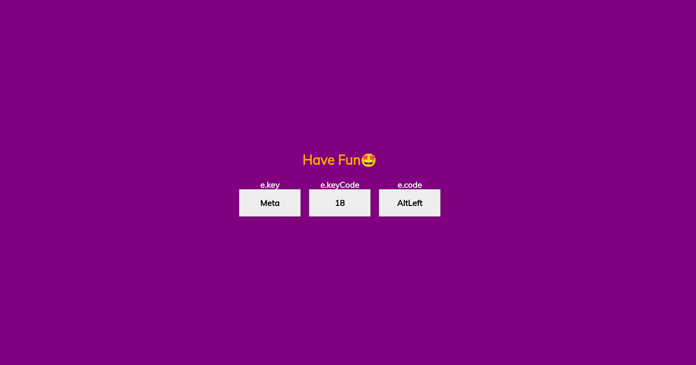

# Keycode_Mini-Project

## Table of contents

1. [Description](#description)
2. [Functionality-Overview](#function-overview)
3. [WebApp Link](#webapp-link)
4. [Author](#author)

## Description

I developed this web application while I was learning JavaScript. Its purpose is to assist JavaScript programmers in quickly obtaining KeyCode information to integrate into their scripts. Enjoy exploring my web app!😊

## Functionality-Overview

_This image illustrates my webapp before pressing any key_

_This image illustrates the result you get after pressing a particular key_

## webApp link

## Author

Placide Imanzi
